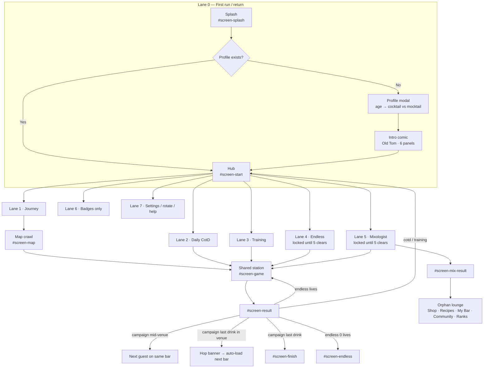
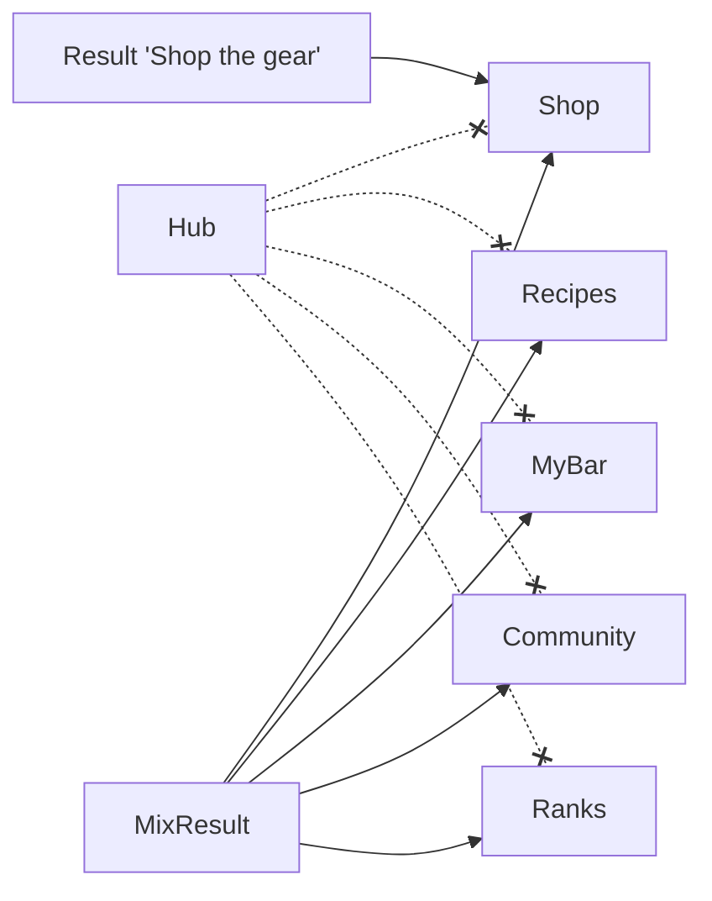
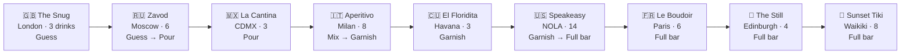
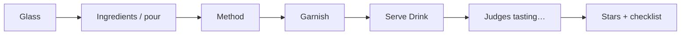

# DAG Tails UI/UX Audit — Game lanes (mobile)

**Date:** 2026-08-16  
**Agent:** `.cursor/skills/dag-tails-ui-ux`  
**Audience:** Landscape phones (primary). Tablets / folds as stress cases. Portrait is rotate-lock by design.  
**Scope:** Draw every player lane, then a mobile UI/UX report per lane vs north-star (venue hero · candy drink path · duck guide · warm gold night · shared CTA/transition grammar).  
**Sources:** `index.html`, `styles.css`, `game.js`, `src/hub/HubScreen.tsx`, `data.js` `VENUES` / `VENUES_UNDER`, `mocks/map-ideas/map-v3-*`, `mocks/hub-fix-ios.png`

This is a **re-audit**. Visual-system blockers from 2026-08-09 (F01–F22) are still live; this pass maps them onto lanes instead of screens.

---

## 1. Summary

DAG Tails already thinks in **lanes** — hub is a side-by-side landscape menu, the journey is nine bars with nested drinks, the station is a left-bar / right-sheet pour. The problem is the **map lane is still a stacked checklist of every bar**, not the mocked one-bar hero → candy drink path. On a landscape phone (~360–430px tall) that crawl is the highest-friction surface in the game: you cannot see “where am I” at a glance, the duck is gone, and venue hops auto-skip the path and dump the player onto the next pour.

The station and result have real mobile adaptations (`is-phone-play`, compact judges, short-height CSS). Hub is the second-best mobile surface (duck left, CTA right). Everything hanging off Mixologist (My Bar, Recipes, Community, Ranks, Shop) is an **orphaned lounge lane** with no hub door. Visual chrome is still purple-night, not gold cocktail night.

**Maturity: beta** for mobile testers — the pour loop is playable in landscape; the journey *map* and the meta lounge are not polish-ready.

**Ranking rule for this pass:** player-facing impact on landscape phones (how many sessions hit it × how much it changes “this is the bar-hop game”). Not engineering order. Tokens-first is cheaper; hero+path is the bigger win.

---

## 2. Priority — most positive impact → least

### Lanes (fix in this order)

| # | Lane | Why this rank |
|---:|---|---|
| 1 | **Journey map** (hero + candy path + duck + hop) | Every Continue tap. Today the worst mobile surface. North-star lives or dies here. |
| 2 | **Shared station + result** | Every pour in every mode. Already the best layout; action-diet and chrome pay off immediately. |
| 3 | **Hub + first run** | Every boot. One primary CTA and a short profile gate decide whether the journey even starts. |
| 4 | **Training** | First-run teaching. Cheap if the map already feels like a bar. |
| 5 | **Endless** | Unlocks after 5 drinks; HUD is already clear. Identity (one bar per shift) matters once Journey looks right. |
| 6 | **Mixologist result** | Unlocks after 5; densest screen, but fewer players, later. |
| 7 | **Meta lounge** (Badges / Book / Shop / social) | Orphaned IA. Important once Mix exists; dead weight until the hub has a door. |
| 8 | **System polish** (rotate lock, rank-up, settings icons) | Correct behavior already; skin and labels only. |

### Findings (most → least impact)

| # | ID | Fix | Who feels it | Why it ranks here |
|---:|---|---|---|---|
| 1 | **F01** | One-bar **venue hero** | Every journey session | Replaces the crawl. Phone finally answers “which bar am I at?” |
| 2 | **F02** | Per-venue **candy drink path** | Every journey session | Hero without a path is a poster. This is the playable map. |
| 3 | **F10** | **Stop auto-load** after hop | End of every venue | Without this, #1–#2 are skipped after bar 1. Enables the new map to be seen. |
| 4 | **F03** | **Duck on hero + current node** | Every map screen | Orientation mascot; hop becomes travel, not a text banner. |
| 5 | **F04** | **Retokenize** warm gold night | Every screen | Makes hub, map, station, result one product. Huge look-impact, still a crawl if done alone. |
| 6 | **F05** | **One gold-lip CTA** (Enter → Pour → Next guest) | Every transition | Continuity. Cheap relative to map rebuild; felt on every tap. |
| 7 | **F11** | **Result action diet** (one Next; Shop as link; hide on fail/endless) | End of every pour | More frequent than Mix. Stops demo Shop competing with progression. |
| 8 | **F21** | Duck roost through station/result | Core loop | Completes #4. Lower than map duck because station already has guest + interior. |
| 9 | **F23** | **Split Speakeasy** (classics vs shots) | Late journey | Path of 14 cannot work on ~360px height. Ranked below hero because early bars (3–6 drinks) ship first. |
| 10 | **F08** | **Demote CotD** on hub | Every boot | Journey becomes the only large CTA on short landscape. |
| 11 | **F24** | **Hub door** for Book / Shop / Ranks / My Bar | Returning + Mix players | Un-orphans five features. No new art required. |
| 12 | **F25** | Unlock Endless/Mix and complexity **at bar doors** | After Snug / each new bar | Modes and rules currently interrupt mid-venue. Better after the hero exists. |
| 13 | **F07** | Hub **wordmark** | Every boot | Brand on the home screen. After CotD is demoted so it has room. |
| 14 | **F22** | **Mix result diet** | Mix only | Painful on phone, but locked until 5 clears and Mix is optional. |
| 15 | **F18** | Profile = **name + age** first | New players once | Drop-off risk on first launch; testers already past it. |
| 16 | **F06** | Delete **`#map-sheet`** | Map | Cleanup once path UI exists. Low player joy by itself. |
| 17 | **F15** | Station back/audio chrome | Every pour | Usable today; mis-taps and “utility app” feel. |
| 18 | **F13** | Warm **lounge cards** + consistent Back | Meta screens | Same-app skin after the hub door exists. |
| 19 | **F09** | Kill purple Mixologist button | Hub caret / Mix | Leftover; small once tokens (#5) land. |
| 20 | **F17** | Comic Next as shared CTA | First run / replay | One screen, skippable. |
| 21 | **F14** | Rank-up / tier intro as gold + duck | Occasional | Celebration overlay; not the loop. |
| 22 | **F16** | Finish / Endless result skin | Crawl complete / shift over | Rare screens; Endless actions already good. |
| 23 | **F12** | Body font / splash chips | Splash + hub | Returning splash clutter; not a blocker. |
| 24 | **F20** | Map hint copy vs dock CTA | Map | Copy-only; follows hero vs path steps. |
| 25 | **F19** | Rotate-lock warm skin | Portrait only | Correct gate; players leave this screen in one turn. |

**Do together (they are one map ship, not three):** F01 + F02 + F10 + F03. Shipping a hero without stopping auto-load wastes the work.

**Do not lead with:** F19, F20, F12, F16 — visible, low session impact.

---

## 3. Lane map (drawn)

There are **seven player lanes**. The Journey lane contains **nine adult venue sub-lanes** (three mocktail venues if under 18). All modes share one station.

Hub doors that **do not exist** (only reachable after a Mixologist serve): Shop, Recipes, My Bar, Community, Leaderboard.

### Journey venue lanes (adult · 55 drinks)

Intended north-star: **one venue hero at a time**, then a **short candy path** of that bar’s drinks. Shipped: every venue + every drink in one vertical crawl (`renderMap` → `.map-venue` + `.map-stages`).

Candy-path length vs the v3 mock (~5 nodes on a landscape bar top):

| Venue lane | Drinks | Candy-path fit on phone landscape | Complexity while you are there |
|---|---:|---|---|
| The Snug | 3 | Fits | Guess (no pour amounts) |
| Zavod | 6 | Tight | Guess then Pour at drink 3 |
| La Cantina | 3 | Fits | Pour |
| Aperitivo Piazza | 8 | Overflow | Mix; last drink flips to Garnish |
| El Floridita | 3 | Fits | Garnish |
| **The Speakeasy** | **14** | **Breaks the pattern** | Garnish → Full bar mid-lane |
| Le Boudoir | 6 | Tight | Full bar |
| The Still | 4 | Fits | Full bar |
| Sunset Tiki | 8 | Overflow | Full bar |

Unlock for Endless + Mixologist: **5 clears** = all of Snug + 2 of Zavod (`STAGES_TO_UNLOCK`). Modes open mid-venue, not after a bar is finished.

Mocktail crawl (age &lt; 18): Soda Fountain (3) → Juice Bar (4) → Beach Shack (5) = 12 drinks. Same map UI, shorter.

### Shared station loop (every play lane)

Early journey hides later steps via `complexityForStage` (Guess → Pour → Mix → Garnish → Full bar). Mixologist always runs the full flow. Training forces Advanced so the coach can teach every step.

---

## 4. Per-lane UI/UX reports (mobile)

### Lane 0 — First run / return

**Job:** Get a landscape-phone player from cold boot to a named bartender, with age gating the menu.

**Flow:** Splash (`#btn-splash-continue`, no auto-advance) → Hub → first-run `#modal-profile` → 6-panel `#screen-intro` → Hub.

**What works**
- Landscape-first is declared on rotate-lock and splash; continue is an explicit CTA, not tap-anywhere.
- Age is a real product split (full bar vs `VENUES_UNDER`), not a legal footnote.
- Comic has skip, dots, tap-to-advance, and a last-panel CTA (“Start my shift”).

**Mobile problems**
- Profile is a **dense form** (name, age, location, email, units) in a modal on ~360px height. Landscape CSS grids it 2-up (`styles.css` profile-form), but location/email still sit in front of the first pour.
- Splash chips duplicate hub stats for returning players; first-run splash is cleaner than returning splash.
- Comic Skip + Next do not match hub’s 3D gold lip (`.cta-main`).
- Rotate-lock box is still purple-tinted (`.rotate-lock-box`). First impression of “gold night” is delayed until (maybe) hub, and hub itself is still purple radials.

**Fix**
- Keep the gate; **name + age first**, units on the same card, location/email later (settings).
- Splash = logo + duck + one CTA. Chips only if returning and they fit without wrapping.
- Style comic Next as `.cta-main`. Warm-token the rotate lock.

---

### Lane 1 — Journey (the core loop)

**Job:** One bar at a time, then pour that bar’s drinks, then hop.

**Flow:** Hub `.cta-main` (`playJourney`) → `#screen-map` → tap drink or dock CTA → `#screen-game` → result → **Next guest** (same venue) or hop banner (next venue) or **See results** (crawl done).

**What works**
- Mid-venue **guest swap** (`advanceGuestInVenue`) is the right beat: stay at the bar, new customer walks in. This already matches “one bar at a time” *during pour*.
- Dock CTA copy names venue + drink (`Pour at The Snug: Gin & Tonic`).
- Locked / current / done states exist on cards (`is-locked` / `is-current` / `is-done`) and on stage buttons.
- Landscape map has a persistent dock so the primary action is thumb-reachable.

**Mobile problems (blockers)**
- **Not a venue hero.** `renderMap` paints **all nine venues** as stacked `.map-venue` cards with nested `<ol class="map-stages">`. On a phone you see ~one card and a sliver of the next. North-star #1 and `map-v3-venue-hero` rejected.
- **Not a candy path.** Drinks are list rows, not nodes on a gold ribbon. Duck placement is a no-op (`.map-duck { display: none }`, `placeDuckOnMap()` empty).
- **Hop auto-skips the map.** `finishVenueHop` calls `loadStage(cleared)` after 1.1s. The player never lands on “new bar hero → Enter → candy path → Pour”. Farewell copy from venue masters (`data.js` `master.farewell`) is unused in the hop banner.
- **Venue length is uneven.** Snug/Cantina/Floridita are 3-node paths (good). Speakeasy is **14 drinks including a shot cluster** — a landscape candy path cannot show 14 nodes without paging, and the current list makes NOLA feel like a homework sheet.
- **Complexity ignores venue walls.** Guess ends mid-Zavod; Mix fills most of Aperitivo; Full bar starts mid-Speakeasy. The player is taught a new rule in the middle of a bar, not at the door.
- Two drink UIs: inline stages **and** leftover `#map-sheet`.
- CTA dialects: hub gold lip vs map `.btn-primary` vs result ghost cluster.

**Fix (visual-unification)**
1. Map step A: full-bleed **current venue only** (carousel dots = 9 bars). Art: `venue.bg`. Duck at the door. CTA: **Enter bar**.
2. Map step B: **that venue’s drinks only** as candy nodes (3–6 visible; page or chapter Speakeasy). Duck on current node. CTA: **Pour**.
3. Hop: banner + duck travel → **land on the new hero, wait**. Do not auto-`loadStage`.
4. Split Speakeasy into two candy chapters (classics vs shots) or cap path length at ~6–8 with a “more in the back room” beat.
5. Align complexity intros to **venue entry** (or first drink of a new rule), not raw stage numbers.

---

### Lane 1a–1i — Venue sub-lanes (mobile candy-path notes)

Each of these should be: hero (exterior) → path (drinks) → interior station (`venue.interior` already used by `applyVenueChrome`). Today they are rows in one list.

**The Snug (3)** — Best tutorial bar. Short path, Guess-only, Old Tom as landlord. Mobile: this should be the first hero the player ever sees; instead it is card #1 in a 55-row crawl. Duck belongs here.

**Zavod (6)** — First “real” length. Unlock of Endless/Mix happens after drink 2 — a toast, not a ceremony, mid-Moscow. Path of 6 is the upper bound of a single landscape ribbon; do not add more.

**La Cantina (3)** — Matches the v3 candy mock (La Cantina · 3 of 5). Shipped UI does not look like that mock. Highest “fix this and the system reads” target.

**Aperitivo Piazza (8)** — Too long for one ribbon; natural split is spritz/bubbles vs bitter (Negroni family). Mix tutorial currently fires on drink 1 of this bar (`stageNo` 13) — good *if* the hero said “tonight you mix.” It doesn’t.

**El Floridita (3)** — Perfect short rum trio. Garnish rule is already on; treat as a palate cleanser after Milan, not another list block.

**The Speakeasy (14)** — **Lane failure.** 14 nodes on ~800×360 is unreadable as a path and exhausting as a list. Shot cluster (Kamikaze, Baby Guinness, B-52, Green Tea, Lemon Drop) should not sit on the same ribbon as Old Fashioned / Sazerac. Split or gate.

**Le Boudoir (6)** — Fine as one path once Speakeasy is chopped. Full-bar cognitive load is high; keep nodes iconic (coupe + drink), not recipe names in 11px.

**The Still (4)** — Good length. Peat/whisky identity is strong in copy (`blurb`) and unused on the map card.

**Sunset Tiki (8)** — Finale should feel like a celebration path, not “8 more list buttons.” Needs the hero + ribbon more than any earlier bar.

**Mocktail crawl (3 venues / 12 drinks)** — Length is healthy. Same crawl UI, so under-18 players inherit every map problem at smaller scale. Hide Community on mix result (`isUnderage`) but the mocktail map still says “bar-hop crawl.”

---

### Lane 2 — Cocktail of the Day

**Job:** One daily pour from the hub, then back.

**Flow:** Hub `.cotd-card` → `loadCotd()` → station (pill “🍹 Daily”) → result “Back to menu”.

**What works**
- Clear daily object; done state (`Done today ✓` / `is-done`).
- Returns to hub, not the map — correct for a side quest.

**Mobile problems**
- On landscape hub the CotD card sits **above** the journey CTA and fights it for the primary job (“start tonight’s shift”).
- Uses campaign complexity (`complexityForStage(cleared+1)`) and a random venue chrome — the daily drink can be a Full-bar recipe while the player is still in Guess.
- No duck, no “today’s special” staging; it reads as a dashboard widget.

**Fix:** Demote CotD to a slim chip or overflow; keep journey as the only large CTA. Cap daily complexity to current map tier.

---

### Lane 3 — Training / Learn

**Job:** Teach glass → pour → mix → garnish on one drink, then graduate to the map.

**Flow:** Hub “📚 Learn” → `loadTraining()` (Daiquiri or Virgin Mojito) → coach (`#coach`) → result “Start the journey →” → **map** (not hub).

**What works**
- Coach copy is step-specific and names the glowing control. Graduation into the map is the right door.
- Help modal (`#modal-how`) exists as a backup.

**Mobile problems**
- Coach + ticket + station + Next on ~360px height: the coach bar steals the guest. `#coach` is on its own grid row in `.game-stage`.
- Learn is a quiet text link under the CTA; first-run players can skip it and hit Guess with no teaching.
- Help modal is a long numbered list — not thumb-friendly, and it still mentions “Endless Shift” / “Recipe Book” as if they were on the hub.

**Fix:** After comic, optional one-tap “Make your first drink with Old Tom” before the map. Compact coach to one line on short landscape. Update Help to match real hub IA.

---

### Lane 4 — Endless

**Job:** Survive a rush (3 lives) with random drinks at current complexity.

**Flow:** Hub caret menu (locked until 5) → `loadEndless()` → result “Next customer” / “End shift” → `#screen-endless` Closing Time.

**What works**
- HUD swap (lives / streak / served) is a clear mode change vs campaign progress bar.
- Closing Time stats + rank copy are scannable. Primary “Work another shift” + Menu is a healthy action diet (better than campaign result).
- Back from step 0 returns to hub (not map) — correct.

**Mobile problems**
- Unlock is a **toast**, not a celebration on the venue hero (“Zavod unlocked the late shift”).
- Venue label is generic “Now serving”; interior chrome hops randomly with the recipe — the bar identity the journey is selling disappears.
- Result still shows Shop + crowded actions like campaign (`#btn-result-shop` is not hidden in endless).
- Lives as emoji hearts in a thin HUD can clip on Flip-cover heights (`max-height: 400px` rules exist for glass, not for HUD).

**Fix:** Keep one bar for the whole shift (or a “pop-up night” hero). Hide Shop on endless result. Celebrate unlock at the bar door, not in a toast.

---

### Lane 5 — Mixologist + orphan lounge

**Job:** Invent → judged → save / share / make another.

**Flow:** Hub caret (locked until 5) → sandbox station (ticket not flippable) → `#screen-mix-result` (scores, panel, tips, **five lounge tabs**, five action buttons, Quit).

**What works**
- Sandbox intent is clear on the ticket. Tweak it / Make another is a real craft loop.
- Empty Community copy tells you to share from Mixologist — honest.

**Mobile problems**
- **Densest screen in the game.** On phone landscape, mix result is forced to `height: 100%` + `overflow: hidden` (`body.is-phone-play .mix-card`). Judges, flavor bars, tips, 5 actions, 5 lounge tabs, and Quit cannot all be primary.
- Lounge nav (Shop / Recipes / My Bar / Community / Ranks) is the **only hub for meta features**. Journey players never see My Bar. Help text promises a Recipe Book “anytime.”
- Purple `.btn-mixologist` leftover in CSS; caret items use `.cta-menu-item` but Mix still feels like a different app after serve.
- Share requires backend; failure is a toast. Under-18 hides Community but other lounge tabs remain.
- Shop is demo and visually equal to Make another.

**Fix:** Mix result = verdict + **Make another** + Tweak. Save/Share as secondary. Move lounge tabs onto the **hub** (or a single “Bar book” door). Label Shop as demo in the CTA, not only in the shop subtitle.

---

### Lane 6 — Meta (Badges · My Bar · Recipes · Shop · Social)

**Job:** Collection, vanity, and social — should feel like the same bar, not an admin panel.

**What works**
- Badges are on the hub and have earned/locked treatment (emoji vs 🔒).
- Secondary screens have empty/error copy (Community, Leaderboard).
- Shop can scope to the drink you just poured (`openShop(recipe)`).

**Mobile problems**
- **IA hole:** only Badges has a hub door. Recipes/My Bar/Shop/Community/Ranks live on mix-result `.mix-lounge`.
- Identical purple card shells (`.badges-card`, `.mybar-card`, …) — “separate app” vs station interiors.
- Back labels mix `← Menu` (map, settings) and `← Back` (lounge).
- Shop checkout is demo but the button looks purchasable (`Checkout (demo)` is small honesty).
- Leaderboard tabs (Most Liked / Daily Streak) are social features with no presence next to hub streak chip.

**Fix:** One hub overflow: Badges · Book · Shop · Ranks. Shared warm lounge chrome. Consistent back chevron.

---

### Lane 7 — System (Settings, profile edit, rotate, mocktail)

**Job:** Stay in landscape, keep audio/units/account without leaving the fantasy.

**What works**
- Rotate lock is the right call for this layout; portrait play is out of scope.
- Settings groups (units, SFX, ambience, account) are simple.
- Mocktail banner on hub when under 18.

**Mobile problems**
- Station topbar duplicates settings (🎵 🔊 Quit) as unlabeled icon pills — easy mis-taps beside Serve on the right sheet.
- Gear on hub is icon-only (⚙) with `title` but no visible label.
- Rank-up / tier-intro overlay (`#rankup`) is a purple gradient with emoji, not duck/venue.

**Fix:** One audio home (settings). Station keeps Quit + back. Rank-up uses duck pose + gold night.

---

### Shared station (used by lanes 1–5)

**Job:** Read the ticket, build, serve — thumbs on a short landscape.

**What works**
- Best mobile layout in the product: bar ~68% / sheet ~32% (`.game-stage #screen-game .stage-area`). Ticket flip for recipe. Serve docked under ingredients.
- Venue interiors actually apply (`applyVenueChrome`).
- Short-height and Flip-cover glass caps exist (`max-height: 400px`).
- Phone result judges compact to a 3-across strip (comment in CSS at landscape `max-height: 560px`).

**Mobile problems**
- Topbar is utility-app (pills + emoji), not bar chrome; back is arrow-only vs map’s “← Menu”.
- Ticket + guest + glass compete; on Mini/SE/Flip cover the guest is easy to lose.
- Result action row: Map + Shop + Retry + Next. Shop is demo and equal weight. Endless still shows Shop.
- Fail state (0 stars) hides Next — good — but Shop remains.

**Fix:** Result = one primary (Next guest / Pour / End shift) + Retry. Shop as text link. Align back control. Keep interiors; add a tiny duck roost on success.

---

## 5. Findings

| ID | Severity | Lane / screen | Problem | Evidence | Suggested fix | Visual-system? |
|---|---|---|---|---|---|---|
| F01 | **Blocker** | Journey map | Multi-venue crawl list, not one-bar hero | `game.js` `renderMap`; `.map-crawl` / `.map-venue`; vs `map-v3-venue-hero` | Venue carousel, full-bleed `venue.bg`, Enter bar | Y |
| F02 | **Blocker** | Journey path | No candy drink path; nested `<ol>` of all drinks | `renderMap` `.map-stages`; vs `map-v3-candy-drinks` | Per-venue nodes + Pour; hide other bars | Y |
| F03 | **Blocker** | Journey | Duck guide removed | `placeDuckOnMap` / `animateDuckTravel` no-ops | Duck on hero + current node; hop = duck travel | Y |
| F10 | **Blocker** | Journey hop | Auto-`loadStage` after hop; skips arrive/Enter | `finishVenueHop` | Land on new hero; wait for Enter/Pour | Y |
| F23 | **Blocker** | Speakeasy lane | 14 drinks (incl. shots) cannot be a phone candy path | `data.js` Speakeasy `drinkIds` length 14 | Split classics vs shots or chapter the path | N |
| F06 | **Major** | Map | Dead `#map-sheet` plus inline stages | `index.html` `#map-sheet`; `openVenueSheet` | Remove sheet | Y |
| F05 | **Major** | Hub → map → result | Three CTA dialects | `.cta-main` vs `#btn-map-play` vs `.result-actions` | One gold-lip CTA; Enter → Pour → Next guest | Y |
| F08 | **Major** | Hub | CotD + chips compete with Journey on short landscape | `HubScreen.tsx` `.hub-quest.cotd-card` | Demote CotD; one primary job | N |
| F24 | **Major** | Mix / meta IA | Shop, Recipes, My Bar, Community, Ranks have **no hub door** | `.mix-lounge` only; hub nav = Badges | Hub “Bar book” / overflow | N |
| F22 | **Major** | Mix result | Too many jobs for ~360px height | `#screen-mix-result`; `is-phone-play .mix-card` overflow hidden | Verdict + Make another; rest overflow | N |
| F11 | **Major** | Result | Shop equal to Next; endless/fail still show Shop | `#btn-result-shop` always in DOM | Primary Next; Shop as link; hide on endless/fail | N |
| F04 | **Major** | Global | Purple night tokens vs gold cocktail night | `:root` `--panel` / body `#2a1c44` | Retokenize warm black/brown + gold | Y |
| F21 | **Major** | Continuity | Duck on hub only; map/station/result drop the guide | Hub `.hub-duck`; map no-ops | Duck through hub → hero → node → optional result roost | Y |
| F25 | **Major** | Progression | Complexity + mode unlock ignore venue boundaries | `complexityForStage`; `STAGES_TO_UNLOCK = 5` | Gate rules and modes at bar doors | N |
| F07 | **Minor** | Hub | No wordmark on React hub | `HubScreen.tsx` | Bebas / logo beside duck | Y |
| F13 | **Minor** | Lounge | Purple admin cards; mixed Back copy | `.badges-card` etc. | Shared warm lounge + chevron | Y |
| F15 | **Minor** | Station | Utility topbar; unlabeled audio | `#screen-game .topbar` | Back matches map; audio in settings | N |
| F17 | **Minor** | Comic | Skip/Next not gold-lip | `#screen-intro` | Shared primary CTA | N |
| F18 | **Polish** | Profile | Long first-run form | `#modal-profile` | Name+age first | N |
| F19 | **Polish** | Rotate lock | Purple box | `#rotate-lock` | Warm night | Y |
| F20 | **Polish** | Map copy | Hint “pick a venue” vs dock “Pour at…” | `#map-hint` vs `updateMapCta` | Copy follows hero vs path step | Y |

Carried forward unchanged from 2026-08-09 unless superseded: F09 (mixologist purple), F12 (Inter/chips), F14 (rank-up purple), F16 (finish/endless chrome).

---

## 6. Ship order (same ranking, bundled)

Impact order, not “tokens first.” The old visual-unification list led with retokenize because it is cheap to do globally; **player impact** still starts at the map.

1. **Map bundle:** venue hero + candy path + stop auto-load + duck on hero/node (F01, F02, F10, F03)
2. **Gold night + one CTA** across splash, hub, map, result (F04, F05)
3. **Result action diet** — one Next, Shop as link, hide on fail/endless (F11)
4. **Duck continuity** onto station/result (F21)
5. **Split Speakeasy** (page Aperitivo / Tiki if the ribbon overflows) (F23)
6. **Hub:** demote CotD, add wordmark, add Bar-book door (F08, F07, F24)
7. **Unlock Endless/Mix and complexity at bar doors** (F25)
8. **Mix result diet** (F22)
9. **First-run profile = name + age** (F18)
10. **Cleanup / skin:** delete `#map-sheet`, station back/audio, lounge chrome, Mix purple, comic/rank-up/finish/rotate/copy (F06, F15, F13, F09, F17, F14, F16, F12, F20, F19)

---

## 7. Out of scope

- Shop payments / real checkout  
- Community/leaderboard backend correctness  
- Mixology scoring rules and recipe balance  
- New economies (gems, lives redesign)  
- Reintroducing a dense city-crawl / multi-building world plate  
- Full comic art rewrite  
- Portrait playability (rotate-lock is intentional)  
- Debug toolbar / diagnostics  
- PC-only glass mount at 800px  

---

## 8. Resolved / Remaining

| Status | Items |
|--------|--------|
| Resolved | None of F01–F22 from 2026-08-09. Station landscape split, compact judges, hub side-by-side, and mocktail venue set remain the working mobile foundations. |
| Remaining | F01–F22 plus new lane findings **F23** (Speakeasy length), **F24** (orphaned lounge IA), **F25** (unlocks/complexity vs venue walls). |
| Re-audit trigger | After Phase 1 map (hero + candy path + duck) lands; re-run this skill before merge. |
