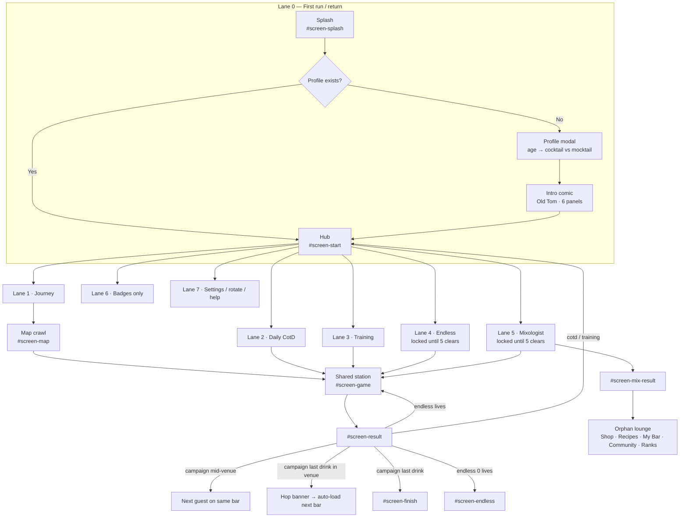
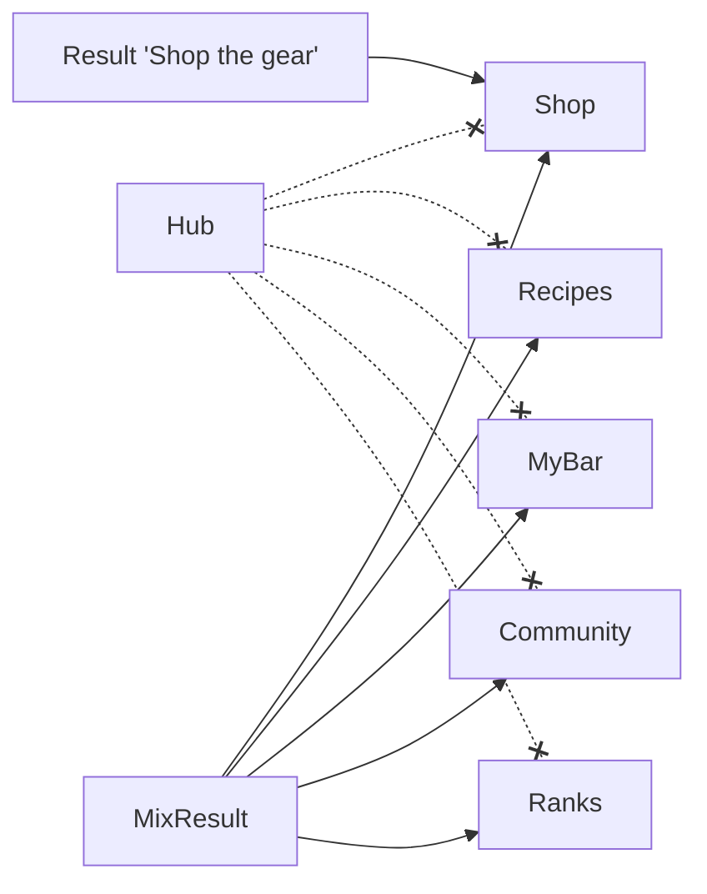
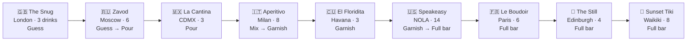
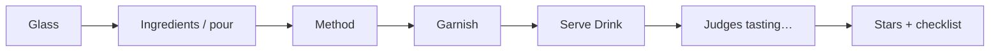
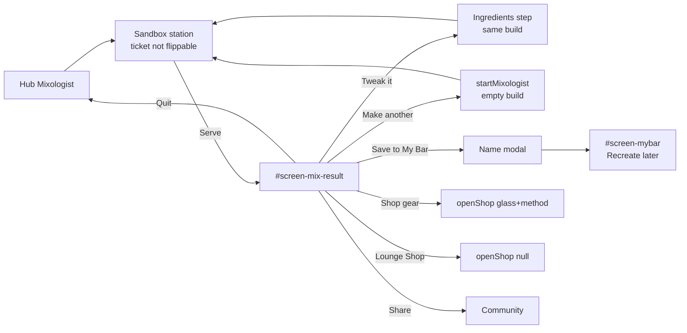

# DAG Tails UI/UX Audit — Game lanes (mobile)

**Date:** 2026-08-16  
**Agent:** `.cursor/skills/dag-tails-ui-ux`  
**Audience:** Landscape phones (primary). Tablets / folds as stress cases. Portrait is rotate-lock by design.  
**Scope:** Draw every player lane, then a mobile UI/UX report per lane vs north-star (venue hero · candy drink path · duck guide · warm gold night · shared CTA/transition grammar).  
**Sources:** `index.html`, `styles.css`, `game.js`, `src/hub/HubScreen.tsx`, `data.js` `VENUES` / `VENUES_UNDER`, `mocks/map-ideas/map-v3-*`, `mocks/hub-fix-ios.png`

This is a **re-audit**. Visual-system blockers from 2026-08-09 (F01–F22) are still live; this pass maps them onto lanes instead of screens.

---

## 1. Summary

DAG Tails already thinks in **lanes** — hub is a side-by-side landscape menu, the journey is nine bars with nested drinks, the station is a left-bar / right-sheet pour. The problem is the **map lane is still a stacked checklist of every bar**, not the mocked one-bar hero → candy drink path. On a landscape phone (~360–430px tall) that crawl is the highest-friction surface in the game: you cannot see “where am I” at a glance, the duck is gone, and venue hops auto-skip the path and dump the player onto the next pour.

The station and result have real mobile adaptations (`is-phone-play`, compact judges, short-height CSS). Hub is the second-best mobile surface (duck left, CTA right). Everything hanging off Mixologist (My Bar, Recipes, Community, Ranks, Shop) is an **orphaned lounge lane** with no hub door. Visual chrome is still purple-night, not gold cocktail night.

**Maturity: beta** for mobile testers — the pour loop is playable in landscape; the journey *map* and the meta lounge are not polish-ready.

**Ranking rule for this pass:** player-facing impact on landscape phones (how many sessions hit it × how much it changes “this is the bar-hop game”). Not engineering order. Tokens-first is cheaper; hero+path is the bigger win.

---

## 2. Priority — most positive impact → least

### Lanes (fix in this order)

| # | Lane | Why this rank |
|---:|---|---|
| 1 | **Journey map** (hero + candy path + duck + hop) | Every Continue tap. Today the worst mobile surface. North-star lives or dies here. |
| 2 | **Shared station + result** | Every pour in every mode. Already the best layout; action-diet and chrome pay off immediately. |
| 3 | **Hub + first run** | Every boot. One primary CTA and a short profile gate decide whether the journey even starts. |
| 4 | **Training** | First-run teaching. Cheap if the map already feels like a bar. |
| 5 | **Endless** | Unlocks after 5 drinks; HUD is already clear. Identity (one bar per shift) matters once Journey looks right. |
| 6 | **Mixologist result** | Unlocks after 5; densest screen, but fewer players, later. |
| 7 | **Meta lounge** (Badges / Book / Shop / social) | Orphaned IA. Important once Mix exists; dead weight until the hub has a door. |
| 8 | **System polish** (rotate lock, rank-up, settings icons) | Correct behavior already; skin and labels only. |

### Findings (most → least impact)

| # | ID | Fix | Who feels it | Why it ranks here |
|---:|---|---|---|---|
| 1 | **F01** | One-bar **venue hero** | Every journey session | Replaces the crawl. Phone finally answers “which bar am I at?” |
| 2 | **F02** | Per-venue **candy drink path** | Every journey session | Hero without a path is a poster. This is the playable map. |
| 3 | **F10** | **Stop auto-load** after hop | End of every venue | Without this, #1–#2 are skipped after bar 1. Enables the new map to be seen. |
| 4 | **F03** | **Duck on hero + current node** | Every map screen | Orientation mascot; hop becomes travel, not a text banner. |
| 5 | **F04** | **Retokenize** warm gold night | Every screen | Makes hub, map, station, result one product. Huge look-impact, still a crawl if done alone. |
| 6 | **F05** | **One gold-lip CTA** (Enter → Pour → Next guest) | Every transition | Continuity. Cheap relative to map rebuild; felt on every tap. |
| 7 | **F11** | **Result action diet** (one Next; Shop as link; hide on fail/endless) | End of every pour | More frequent than Mix. Stops demo Shop competing with progression. |
| 8 | **F21** | Duck roost through station/result | Core loop | Completes #4. Lower than map duck because station already has guest + interior. |
| 9 | **F23** | **Split Speakeasy** (classics vs shots) | Late journey | Path of 14 cannot work on ~360px height. Ranked below hero because early bars (3–6 drinks) ship first. |
| 10 | **F08** | **Demote CotD** on hub | Every boot | Journey becomes the only large CTA on short landscape. |
| 11 | **F24** | **Hub door** for Book / Shop / Ranks / My Bar | Returning + Mix players | Un-orphans five features. No new art required. |
| 12 | **F25** | Unlock Endless/Mix and complexity **at bar doors** | After Snug / each new bar | Modes and rules currently interrupt mid-venue. Better after the hero exists. |
| 13 | **F07** | Hub **wordmark** | Every boot | Brand on the home screen. After CotD is demoted so it has room. |
| 14 | **F22** | **Mix result diet** | Mix only | Painful on phone, but locked until 5 clears and Mix is optional. |
| 15 | **F18** | Profile = **name + age** first | New players once | Drop-off risk on first launch; testers already past it. |
| 16 | **F06** | Delete **`#map-sheet`** | Map | Cleanup once path UI exists. Low player joy by itself. |
| 17 | **F15** | Station back/audio chrome | Every pour | Usable today; mis-taps and “utility app” feel. |
| 18 | **F13** | Warm **lounge cards** + consistent Back | Meta screens | Same-app skin after the hub door exists. |
| 19 | **F09** | Kill purple Mixologist button | Hub caret / Mix | Leftover; small once tokens (#5) land. |
| 20 | **F17** | Comic Next as shared CTA | First run / replay | One screen, skippable. |
| 21 | **F14** | Rank-up / tier intro as gold + duck | Occasional | Celebration overlay; not the loop. |
| 22 | **F16** | Finish / Endless result skin | Crawl complete / shift over | Rare screens; Endless actions already good. |
| 23 | **F12** | Body font / splash chips | Splash + hub | Returning splash clutter; not a blocker. |
| 24 | **F20** | Map hint copy vs dock CTA | Map | Copy-only; follows hero vs path steps. |
| 25 | **F19** | Rotate-lock warm skin | Portrait only | Correct gate; players leave this screen in one turn. |

**Do together (they are one map ship, not three):** F01 + F02 + F10 + F03. Shipping a hero without stopping auto-load wastes the work.

**Do not lead with:** F19, F20, F12, F16 — visible, low session impact.

---

## 3. Lane map (drawn)

There are **seven player lanes**. The Journey lane contains **nine adult venue sub-lanes** (three mocktail venues if under 18). All modes share one station.



Hub doors that **do not exist** (only reachable after a Mixologist serve): Shop, Recipes, My Bar, Community, Leaderboard.



### Journey venue lanes (adult · 55 drinks)

Intended north-star: **one venue hero at a time**, then a **short candy path** of that bar’s drinks. Shipped: every venue + every drink in one vertical crawl (`renderMap` → `.map-venue` + `.map-stages`).



Candy-path length vs the v3 mock (~5 nodes on a landscape bar top):

| Venue lane | Drinks | Candy-path fit on phone landscape | Complexity while you are there |
|---|---:|---|---|
| The Snug | 3 | Fits | Guess (no pour amounts) |
| Zavod | 6 | Tight | Guess then Pour at drink 3 |
| La Cantina | 3 | Fits | Pour |
| Aperitivo Piazza | 8 | Overflow | Mix; last drink flips to Garnish |
| El Floridita | 3 | Fits | Garnish |
| **The Speakeasy** | **14** | **Breaks the pattern** | Garnish → Full bar mid-lane |
| Le Boudoir | 6 | Tight | Full bar |
| The Still | 4 | Fits | Full bar |
| Sunset Tiki | 8 | Overflow | Full bar |

Unlock for Endless + Mixologist: **5 clears** = all of Snug + 2 of Zavod (`STAGES_TO_UNLOCK`). Modes open mid-venue, not after a bar is finished.

Mocktail crawl (age &lt; 18): Soda Fountain (3) → Juice Bar (4) → Beach Shack (5) = 12 drinks. Same map UI, shorter.

### Shared station loop (every play lane)



Early journey hides later steps via `complexityForStage` (Guess → Pour → Mix → Garnish → Full bar). Mixologist always runs the full flow. Training forces Advanced so the coach can teach every step.

---

## 4. Per-lane UI/UX reports (mobile)

### Lane 0 — First run / return

**Job:** Get a landscape-phone player from cold boot to a named bartender, with age gating the menu.

**Flow:** Splash (`#btn-splash-continue`, no auto-advance) → Hub → first-run `#modal-profile` → 6-panel `#screen-intro` → Hub.

**What works**
- Landscape-first is declared on rotate-lock and splash; continue is an explicit CTA, not tap-anywhere.
- Age is a real product split (full bar vs `VENUES_UNDER`), not a legal footnote.
- Comic has skip, dots, tap-to-advance, and a last-panel CTA (“Start my shift”).

**Mobile problems**
- Profile is a **dense form** (name, age, location, email, units) in a modal on ~360px height. Landscape CSS grids it 2-up (`styles.css` profile-form), but location/email still sit in front of the first pour.
- Splash chips duplicate hub stats for returning players; first-run splash is cleaner than returning splash.
- Comic Skip + Next do not match hub’s 3D gold lip (`.cta-main`).
- Rotate-lock box is still purple-tinted (`.rotate-lock-box`). First impression of “gold night” is delayed until (maybe) hub, and hub itself is still purple radials.

**Fix**
- Keep the gate; **name + age first**, units on the same card, location/email later (settings).
- Splash = logo + duck + one CTA. Chips only if returning and they fit without wrapping.
- Style comic Next as `.cta-main`. Warm-token the rotate lock.

---

### Lane 1 — Journey (the core loop)

**Job:** One bar at a time, then pour that bar’s drinks, then hop.

**Flow:** Hub `.cta-main` (`playJourney`) → `#screen-map` → tap drink or dock CTA → `#screen-game` → result → **Next guest** (same venue) or hop banner (next venue) or **See results** (crawl done).

**What works**
- Mid-venue **guest swap** (`advanceGuestInVenue`) is the right beat: stay at the bar, new customer walks in. This already matches “one bar at a time” *during pour*.
- Dock CTA copy names venue + drink (`Pour at The Snug: Gin & Tonic`).
- Locked / current / done states exist on cards (`is-locked` / `is-current` / `is-done`) and on stage buttons.
- Landscape map has a persistent dock so the primary action is thumb-reachable.

**Mobile problems (blockers)**
- **Not a venue hero.** `renderMap` paints **all nine venues** as stacked `.map-venue` cards with nested `<ol class="map-stages">`. On a phone you see ~one card and a sliver of the next. North-star #1 and `map-v3-venue-hero` rejected.
- **Not a candy path.** Drinks are list rows, not nodes on a gold ribbon. Duck placement is a no-op (`.map-duck { display: none }`, `placeDuckOnMap()` empty).
- **Hop auto-skips the map.** `finishVenueHop` calls `loadStage(cleared)` after 1.1s. The player never lands on “new bar hero → Enter → candy path → Pour”. Farewell copy from venue masters (`data.js` `master.farewell`) is unused in the hop banner.
- **Venue length is uneven.** Snug/Cantina/Floridita are 3-node paths (good). Speakeasy is **14 drinks including a shot cluster** — a landscape candy path cannot show 14 nodes without paging, and the current list makes NOLA feel like a homework sheet.
- **Complexity ignores venue walls.** Guess ends mid-Zavod; Mix fills most of Aperitivo; Full bar starts mid-Speakeasy. The player is taught a new rule in the middle of a bar, not at the door.
- Two drink UIs: inline stages **and** leftover `#map-sheet`.
- CTA dialects: hub gold lip vs map `.btn-primary` vs result ghost cluster.

**Fix (visual-unification)**
1. Map step A: full-bleed **current venue only** (carousel dots = 9 bars). Art: `venue.bg`. Duck at the door. CTA: **Enter bar**.
2. Map step B: **that venue’s drinks only** as candy nodes (3–6 visible; page or chapter Speakeasy). Duck on current node. CTA: **Pour**.
3. Hop: banner + duck travel → **land on the new hero, wait**. Do not auto-`loadStage`.
4. Split Speakeasy into two candy chapters (classics vs shots) or cap path length at ~6–8 with a “more in the back room” beat.
5. Align complexity intros to **venue entry** (or first drink of a new rule), not raw stage numbers.

---

### Lane 1a–1i — Venue sub-lanes (mobile candy-path notes)

Each of these should be: hero (exterior) → path (drinks) → interior station (`venue.interior` already used by `applyVenueChrome`). Today they are rows in one list.

**The Snug (3)** — Best tutorial bar. Short path, Guess-only, Old Tom as landlord. Mobile: this should be the first hero the player ever sees; instead it is card #1 in a 55-row crawl. Duck belongs here.

**Zavod (6)** — First “real” length. Unlock of Endless/Mix happens after drink 2 — a toast, not a ceremony, mid-Moscow. Path of 6 is the upper bound of a single landscape ribbon; do not add more.

**La Cantina (3)** — Matches the v3 candy mock (La Cantina · 3 of 5). Shipped UI does not look like that mock. Highest “fix this and the system reads” target.

**Aperitivo Piazza (8)** — Too long for one ribbon; natural split is spritz/bubbles vs bitter (Negroni family). Mix tutorial currently fires on drink 1 of this bar (`stageNo` 13) — good *if* the hero said “tonight you mix.” It doesn’t.

**El Floridita (3)** — Perfect short rum trio. Garnish rule is already on; treat as a palate cleanser after Milan, not another list block.

**The Speakeasy (14)** — **Lane failure.** 14 nodes on ~800×360 is unreadable as a path and exhausting as a list. Shot cluster (Kamikaze, Baby Guinness, B-52, Green Tea, Lemon Drop) should not sit on the same ribbon as Old Fashioned / Sazerac. Split or gate.

**Le Boudoir (6)** — Fine as one path once Speakeasy is chopped. Full-bar cognitive load is high; keep nodes iconic (coupe + drink), not recipe names in 11px.

**The Still (4)** — Good length. Peat/whisky identity is strong in copy (`blurb`) and unused on the map card.

**Sunset Tiki (8)** — Finale should feel like a celebration path, not “8 more list buttons.” Needs the hero + ribbon more than any earlier bar.

**Mocktail crawl (3 venues / 12 drinks)** — Length is healthy. Same crawl UI, so under-18 players inherit every map problem at smaller scale. Hide Community on mix result (`isUnderage`) but the mocktail map still says “bar-hop crawl.”

---

### Lane 2 — Cocktail of the Day

**Job:** One daily pour from the hub, then back.

**Flow:** Hub `.cotd-card` → `loadCotd()` → station (pill “🍹 Daily”) → result “Back to menu”.

**What works**
- Clear daily object; done state (`Done today ✓` / `is-done`).
- Returns to hub, not the map — correct for a side quest.

**Mobile problems**
- On landscape hub the CotD card sits **above** the journey CTA and fights it for the primary job (“start tonight’s shift”).
- Uses campaign complexity (`complexityForStage(cleared+1)`) and a random venue chrome — the daily drink can be a Full-bar recipe while the player is still in Guess.
- No duck, no “today’s special” staging; it reads as a dashboard widget.

**Fix:** Demote CotD to a slim chip or overflow; keep journey as the only large CTA. Cap daily complexity to current map tier.

---

### Lane 3 — Training / Learn

**Job:** Teach glass → pour → mix → garnish on one drink, then graduate to the map.

**Flow:** Hub “📚 Learn” → `loadTraining()` (Daiquiri or Virgin Mojito) → coach (`#coach`) → result “Start the journey →” → **map** (not hub).

**What works**
- Coach copy is step-specific and names the glowing control. Graduation into the map is the right door.
- Help modal (`#modal-how`) exists as a backup.

**Mobile problems**
- Coach + ticket + station + Next on ~360px height: the coach bar steals the guest. `#coach` is on its own grid row in `.game-stage`.
- Learn is a quiet text link under the CTA; first-run players can skip it and hit Guess with no teaching.
- Help modal is a long numbered list — not thumb-friendly, and it still mentions “Endless Shift” / “Recipe Book” as if they were on the hub.

**Fix:** After comic, optional one-tap “Make your first drink with Old Tom” before the map. Compact coach to one line on short landscape. Update Help to match real hub IA.

---

### Lane 4 — Endless

**Job:** Survive a rush (3 lives) with random drinks at current complexity.

**Flow:** Hub caret menu (locked until 5) → `loadEndless()` → result “Next customer” / “End shift” → `#screen-endless` Closing Time.

**What works**
- HUD swap (lives / streak / served) is a clear mode change vs campaign progress bar.
- Closing Time stats + rank copy are scannable. Primary “Work another shift” + Menu is a healthy action diet (better than campaign result).
- Back from step 0 returns to hub (not map) — correct.

**Mobile problems**
- Unlock is a **toast**, not a celebration on the venue hero (“Zavod unlocked the late shift”).
- Venue label is generic “Now serving”; interior chrome hops randomly with the recipe — the bar identity the journey is selling disappears.
- Result still shows Shop + crowded actions like campaign (`#btn-result-shop` is not hidden in endless).
- Lives as emoji hearts in a thin HUD can clip on Flip-cover heights (`max-height: 400px` rules exist for glass, not for HUD).

**Fix:** Keep one bar for the whole shift (or a “pop-up night” hero). Hide Shop on endless result. Celebrate unlock at the bar door, not in a toast.

---

### Lane 5 — Mixologist + orphan lounge

**Job:** Invent → judged → save / share / make another.

**Flow:** Hub caret (locked until 5) → sandbox station (ticket not flippable) → `#screen-mix-result` (scores, panel, tips, **five lounge tabs**, five action buttons, Quit).

**What works**
- Sandbox intent is clear on the ticket. Tweak it / Make another is a real craft loop.
- Empty Community copy tells you to share from Mixologist — honest.

**Mobile problems**
- **Densest screen in the game.** On phone landscape, mix result is forced to `height: 100%` + `overflow: hidden` (`body.is-phone-play .mix-card`). Judges, flavor bars, tips, 5 actions, 5 lounge tabs, and Quit cannot all be primary.
- Lounge nav (Shop / Recipes / My Bar / Community / Ranks) is the **only hub for meta features**. Journey players never see My Bar. Help text promises a Recipe Book “anytime.”
- Purple `.btn-mixologist` leftover in CSS; caret items use `.cta-menu-item` but Mix still feels like a different app after serve.
- Share requires backend; failure is a toast. Under-18 hides Community but other lounge tabs remain.
- Shop is demo and visually equal to Make another.

**Fix:** Mix result = verdict + **Make another** + Tweak. Save/Share as secondary. Move lounge tabs onto the **hub** (or a single “Bar book” door). Label Shop as demo in the CTA, not only in the shop subtitle.

---

### Lane 6 — Meta (Badges · My Bar · Recipes · Shop · Social)

**Job:** Collection, vanity, and social — should feel like the same bar, not an admin panel.

**What works**
- Badges are on the hub and have earned/locked treatment (emoji vs 🔒).
- Secondary screens have empty/error copy (Community, Leaderboard).
- Shop can scope to the drink you just poured (`openShop(recipe)`).

**Mobile problems**
- **IA hole:** only Badges has a hub door. Recipes/My Bar/Shop/Community/Ranks live on mix-result `.mix-lounge`.
- Identical purple card shells (`.badges-card`, `.mybar-card`, …) — “separate app” vs station interiors.
- Back labels mix `← Menu` (map, settings) and `← Back` (lounge).
- Shop checkout is demo but the button looks purchasable (`Checkout (demo)` is small honesty).
- Leaderboard tabs (Most Liked / Daily Streak) are social features with no presence next to hub streak chip.

**Fix:** One hub overflow: Badges · Book · Shop · Ranks. Shared warm lounge chrome. Consistent back chevron.

---

### Lane 7 — System (Settings, profile edit, rotate, mocktail)

**Job:** Stay in landscape, keep audio/units/account without leaving the fantasy.

**What works**
- Rotate lock is the right call for this layout; portrait play is out of scope.
- Settings groups (units, SFX, ambience, account) are simple.
- Mocktail banner on hub when under 18.

**Mobile problems**
- Station topbar duplicates settings (🎵 🔊 Quit) as unlabeled icon pills — easy mis-taps beside Serve on the right sheet.
- Gear on hub is icon-only (⚙) with `title` but no visible label.
- Rank-up / tier-intro overlay (`#rankup`) is a purple gradient with emoji, not duck/venue.

**Fix:** One audio home (settings). Station keeps Quit + back. Rank-up uses duck pose + gold night.

---

### Shared station (used by lanes 1–5)

**Job:** Read the ticket, build, serve — thumbs on a short landscape.

**What works**
- Best mobile layout in the product: bar ~68% / sheet ~32% (`.game-stage #screen-game .stage-area`). Ticket flip for recipe. Serve docked under ingredients.
- Venue interiors actually apply (`applyVenueChrome`).
- Short-height and Flip-cover glass caps exist (`max-height: 400px`).
- Phone result judges compact to a 3-across strip (comment in CSS at landscape `max-height: 560px`).

**Mobile problems**
- Topbar is utility-app (pills + emoji), not bar chrome; back is arrow-only vs map’s “← Menu”.
- Ticket + guest + glass compete; on Mini/SE/Flip cover the guest is easy to lose.
- Result action row: Map + Shop + Retry + Next. Shop is demo and equal weight. Endless still shows Shop.
- Fail state (0 stars) hides Next — good — but Shop remains.

**Fix:** Result = one primary (Next guest / Pour / End shift) + Retry. Shop as text link. Align back control. Keep interiors; add a tiny duck roost on success.

---

## 5. Findings

| ID | Severity | Lane / screen | Problem | Evidence | Suggested fix | Visual-system? |
|---|---|---|---|---|---|---|
| F01 | **Blocker** | Journey map | Multi-venue crawl list, not one-bar hero | `game.js` `renderMap`; `.map-crawl` / `.map-venue`; vs `map-v3-venue-hero` | Venue carousel, full-bleed `venue.bg`, Enter bar | Y |
| F02 | **Blocker** | Journey path | No candy drink path; nested `<ol>` of all drinks | `renderMap` `.map-stages`; vs `map-v3-candy-drinks` | Per-venue nodes + Pour; hide other bars | Y |
| F03 | **Blocker** | Journey | Duck guide removed | `placeDuckOnMap` / `animateDuckTravel` no-ops | Duck on hero + current node; hop = duck travel | Y |
| F10 | **Blocker** | Journey hop | Auto-`loadStage` after hop; skips arrive/Enter | `finishVenueHop` | Land on new hero; wait for Enter/Pour | Y |
| F23 | **Blocker** | Speakeasy lane | 14 drinks (incl. shots) cannot be a phone candy path | `data.js` Speakeasy `drinkIds` length 14 | Split classics vs shots or chapter the path | N |
| F06 | **Major** | Map | Dead `#map-sheet` plus inline stages | `index.html` `#map-sheet`; `openVenueSheet` | Remove sheet | Y |
| F05 | **Major** | Hub → map → result | Three CTA dialects | `.cta-main` vs `#btn-map-play` vs `.result-actions` | One gold-lip CTA; Enter → Pour → Next guest | Y |
| F08 | **Major** | Hub | CotD + chips compete with Journey on short landscape | `HubScreen.tsx` `.hub-quest.cotd-card` | Demote CotD; one primary job | N |
| F24 | **Major** | Mix / meta IA | Shop, Recipes, My Bar, Community, Ranks have **no hub door** | `.mix-lounge` only; hub nav = Badges | Hub “Bar book” / overflow | N |
| F22 | **Major** | Mix result | Too many jobs for ~360px height | `#screen-mix-result`; `is-phone-play .mix-card` overflow hidden | Verdict + Make another; rest overflow | N |
| F11 | **Major** | Result | Shop equal to Next; endless/fail still show Shop | `#btn-result-shop` always in DOM | Primary Next; Shop as link; hide on endless/fail | N |
| F04 | **Major** | Global | Purple night tokens vs gold cocktail night | `:root` `--panel` / body `#2a1c44` | Retokenize warm black/brown + gold | Y |
| F21 | **Major** | Continuity | Duck on hub only; map/station/result drop the guide | Hub `.hub-duck`; map no-ops | Duck through hub → hero → node → optional result roost | Y |
| F25 | **Major** | Progression | Complexity + mode unlock ignore venue boundaries | `complexityForStage`; `STAGES_TO_UNLOCK = 5` | Gate rules and modes at bar doors | N |
| F07 | **Minor** | Hub | No wordmark on React hub | `HubScreen.tsx` | Bebas / logo beside duck | Y |
| F13 | **Minor** | Lounge | Purple admin cards; mixed Back copy | `.badges-card` etc. | Shared warm lounge + chevron | Y |
| F15 | **Minor** | Station | Utility topbar; unlabeled audio | `#screen-game .topbar` | Back matches map; audio in settings | N |
| F17 | **Minor** | Comic | Skip/Next not gold-lip | `#screen-intro` | Shared primary CTA | N |
| F18 | **Polish** | Profile | Long first-run form | `#modal-profile` | Name+age first | N |
| F19 | **Polish** | Rotate lock | Purple box | `#rotate-lock` | Warm night | Y |
| F20 | **Polish** | Map copy | Hint “pick a venue” vs dock “Pour at…” | `#map-hint` vs `updateMapCta` | Copy follows hero vs path step | Y |

Carried forward unchanged from 2026-08-09 unless superseded: F09 (mixologist purple), F12 (Inter/chips), F14 (rank-up purple), F16 (finish/endless chrome).

---

## 6. Ship order (same ranking, bundled)

Impact order, not “tokens first.” The old visual-unification list led with retokenize because it is cheap to do globally; **player impact** still starts at the map.

1. **Map bundle:** venue hero + candy path + stop auto-load + duck on hero/node (F01, F02, F10, F03)
2. **Gold night + one CTA** across splash, hub, map, result (F04, F05)
3. **Result action diet** — one Next, Shop as link, hide on fail/endless (F11)
4. **Duck continuity** onto station/result (F21)
5. **Split Speakeasy** (page Aperitivo / Tiki if the ribbon overflows) (F23)
6. **Hub:** demote CotD, add wordmark, add Bar-book door (F08, F07, F24)
7. **Unlock Endless/Mix and complexity at bar doors** (F25)
8. **Mix result diet** (F22)
9. **First-run profile = name + age** (F18)
10. **Cleanup / skin:** delete `#map-sheet`, station back/audio, lounge chrome, Mix purple, comic/rank-up/finish/rotate/copy (F06, F15, F13, F09, F17, F14, F16, F12, F20, F19)

---

## 7. Out of scope

- Shop payments / real checkout  
- Community/leaderboard backend correctness  
- Mixology scoring rules and recipe balance  
- New economies (gems, lives redesign)  
- Reintroducing a dense city-crawl / multi-building world plate  
- Full comic art rewrite  
- Portrait playability (rotate-lock is intentional)  
- Debug toolbar / diagnostics  
- PC-only glass mount at 800px  

---

## 8. Resolved / Remaining

| Status | Items |
|--------|--------|
| Resolved | None of F01–F22 from 2026-08-09. Station landscape split, compact judges, hub side-by-side, and mocktail venue set remain the working mobile foundations. |
| Remaining | F01–F22 plus new lane findings **F23** (Speakeasy length), **F24** (orphaned lounge IA), **F25** (unlocks/complexity vs venue walls). |
| Re-audit trigger | After Phase 1 map (hero + candy path + duck) lands; re-run this skill before merge. |

---

## 9. Hub mock whitespace — 2026-08-16 (evening)

**Surface:** Landscape-phone hub mock `mocks/hub-layout-venue-stage-mobile.png` (852×393 @2x).  
**Live code:** `#screen-start` / `.hub-shell` / `#hub-duck` in `src/hub/HubScreen.tsx`, `styles.css`.  
**Maturity of this mock:** prototype. One gold CTA is right; the composition is still a left sticker + right HUD over empty steel.

### Summary

The “white space” is not missing widgets. It is a **gap in the composition**. The duck hugs the left of the bar; Continue + CotD hug the right; Zavod’s photo leaves a dark lounge and a blank counter in the middle. Removing the venue lockup and drink path (correct for a quieter hub) took away the only objects occupying that middle — so the page now fails **hierarchy in one glance** and **duck as guide**. North-star fill for that hole is the **per-venue candy path**, but that belongs on the map, not as a second hub dashboard. On the hub, fill the hole by **clustering duck + Continue** on the busy part of the interior, not by adding more chrome.

### Findings

| ID | Severity | Screen | Problem | Evidence | Suggested fix | Visual-system? |
|----|----------|--------|---------|----------|---------------|----------------|
| H1 | Major | Hub mock | Empty bar between mascot and CTA — two foci, no stage | Duck ~left 8%; Continue ~right 61%; `hub-layout-venue-stage-mobile.png` | Treat duck + Continue as **one unit**: duck center-left on the counter, gold pill 24–40px to his right at chest height. Crop/position interior so bottles sit behind that unit (`hubBgPos` toward the backbar, not the lounge void). | Y |
| H2 | Major | Hub mock | CotD is a second wide bar under Continue, stretching a HUD column | `#cotd-card` grammar in mock; live `.hub-quest` | Keep CotD **demoted** (F08): one line under Continue, same width as the pill, not a rival slab. | Y |
| H3 | Minor | Hub mock | Utility chips (Badges / Learn / Help) float in leftover counter | Bottom row in mock; live `.hub-nav` / `.hub-modes` | Pin them to the **bottom-right of the CTA cluster** (or a single ⋯), not a third island in the middle of the bar. | N |
| H4 | Polish | Hub mock | Profile + level still occupy opposite corners, forcing eye travel | Top-left / top-right chips | Keep, but smaller; they are status, not layout. Do not use them to “fill” the void. | N |

### Top fixes (for the next mock / live hub)

1. **Cluster, don’t spread** — duck presents Continue. Gap between sneaker and pill ≈ one duck-width, not half the screen.
2. **Aim the photo at the backbar** — `background-size` ~140–160%, `background-position` on the bottle wall, so the lounge hole is cropped out. Venue hero stays one bar; we just pick the busy half.
3. **Do not refill with a 6-drink path on the hub** — that path is the **map** (`map-v3-candy-drinks`). Hub job is: you’re at this bar, tap Continue.
4. **One gold pill**, CotD as caption, utilities as chips attached to that stack.
5. Live selectors to change after the mock is approved: `#hub-duck` `left`/`bottom`, `.hub-cta` / `.cta-main` max-width, `.hub-quest` width, `--hub-bg-pos` / `--hub-bg-size` on `.hub-shell.has-venue-bg`.

### Out of scope (this pass)

- Reintroducing ZAVOD wordmark or six named drinks on the hub
- City crawl / multi-bar plate
- Implementing live CSS until a clustered mock is chosen

---

## 10. Map path glass tiles — 2026-08-18

**Surface:** Candy drink path (`.map-node` / `.map-node-glass img` on `#map-path`).  
**Evidence:** Player screenshot of Zavod node 1 (Screwdriver); `assets/glasses/*.png` are **RGB, no alpha** (corner ~253,253,254).  
**Maturity:** beta path chrome with a **catalog-photo** glyph — not candy, not station glass.

### Summary

The gold bezel and dark node are the right candy grammar (`map-v3-candy-drinks`). What sits inside is wrong: `drinkGlassSrc()` feeds shop-style product shots (`GLASS_PHOTO` in `glass.js`) into a 34×32px well. Those PNGs have no transparency, so each node punches a **white rectangle** through the gold night. That is a visual-system break (Major): the path looks like a merch grid, not a drink trail. The station already has the correct vessel language — `Glass.buildGlass()` SVG with liquid — and the v3 mock shows **filled, colored cocktails** in the disc, never empty glassware on a white plate.

**Call:** do not keep the PNG on the path. Either a filled SVG glass (same as the station) or a number-only gold candy. Do not “crop the white” in CSS as the long-term look.

### Findings

| ID | Severity | Screen | Problem | Evidence | Suggested fix | Visual-system? |
|----|----------|--------|---------|----------|---------------|----------------|
| P1 | Major | Map path | Opaque white glass photo in the candy node | `.map-node-glass img`; `assets/glasses/highball.png` mode RGB; `game.js` `drinkGlassSrc()` | Stop using `GLASS_PHOTO` on `.map-node`. Put a **drink token** in the disc (see Top fixes). | Y |
| P2 | Minor | Map path | Empty grayscale glass does not encode the cocktail | Screwdriver node shows a blank highball | Token should read as the *drink* (liquid color / SVG fill), not the SKU of the glass. Name already sits under the node. | Y |
| P3 | Polish | Map path | 32px product shot is unreadable on landscape phone | `max-width/height: 32px` on `.map-node-glass img` | If keeping a vessel, use the station SVG at ~28px, not a 1024×1536 JPEG-style PNG. | N |

### Recommended visual (pick one)

**1. Preferred — station SVG in the candy disc (no new art)**  
Inner HTML of `.map-node-glass` becomes a scaled `Glass.buildGlass(recipe.glass)` (or a tiny “icon” profile: rim + liquid band only). Fill liquid from the recipe’s typical color (Screwdriver = orange, Mule = copper, etc.) or a single gold-amber fill. Clip to the circle. Same glass language as the pour, zero white plate.

**2. Strong candy alternative — number is the glyph**  
Drop the photo. Current node = gold disc + big **1**; locked = dim disc + lock; done = gold disc + check. Name stays under the node. Matches classic candy paths and the north-star “one job: pick the drink.” Use this if SVG-at-32px still feels busy next to the duck.

**3. Reject as the target look**  
- `mix-blend-mode: multiply` to knock out white (works on the dark node, eats glass highlights, still an empty catalog glass).  
- Re-export PNGs with alpha only (fixes the rectangle, keeps the empty highball — still not candy).  
- White circle mask around the PNG (makes a white *disc* instead of a white *rect* — same bug, rounder).

### Top fixes

1. **P1** — Remove `GLASS_PHOTO` from path nodes.
2. **Preferred token** — SVG glass + liquid, clipped in `.map-node`.
3. **Fallback token** — number-only gold candy if the SVG is muddy at 32px.
4. Leave `GLASS_PHOTO` on the station / shop if those surfaces need the catalog shot — path is not shop.

### Out of scope

- New illustrated cocktail stickers (v3 mock art) until we have a set for every recipe
- Changing path layout, ribbon, or duck settle
- Implementing this pass (recommendation only)

### Resolved / remaining (this slice)

| | |
|---|---|
| Resolved | P1–P3 live: glass photos removed; stars in the disc, filled only when earned; path duck hidden. |
| Remaining | Hub H1–H4 unchanged. Current-stop pop is §11. |

---

## 11. Candy path — current stop does not pop — 2026-08-18

**Surface:** `#map-path` `.map-node.is-current` (frontier drink). Player asked to drop the path duck and still **see which stop they are on**.  
**Evidence:** Live `.map-node.is-current` was only +8px and a soft gold `box-shadow`; locked/done nodes share the same gold ribbon and dark discs, so the current stop did not read at a glance on landscape. v3 mock (`mocks/map-ideas/map-v3-candy-drinks.jpg`) uses a thicker halo, sparkles, and a marker on the active node.  
**Maturity:** beta candy path; orientation is the remaining path job.

### Summary

Stars-in-disc + earned-only fill is the right glyph. After removing the duck, **orientation collapsed**: current, selected, and done all looked like gold-ringed candy. North-star still wants a guide on the path, but the player rule for this screen is **no duck**. Emphasize with candy grammar instead: bigger disc, hard gold halo, pulse, and a **NOW** chip. Do not restore the mascot on `#map-path-duck`. Do not grow every node — contrast is the pop.

**Maturity: beta** — playable; current stop must be readable before polish-ready.

### Findings

| ID | Severity | Screen | Problem | Evidence | Suggested fix | Visual-system? |
|----|----------|--------|---------|----------|---------------|----------------|
| C1 | Major | Map path | Current stop does not pop vs other gold discs | `.map-node.is-current` size 64px vs 56px; same gold family as ribbon | Scale + hard double ring + pulse + NOW chip on `.is-current` only | Y |
| C2 | Minor | Map path | `.is-selected` used the same glow as current | `.map-node.is-current, .map-node.is-selected` shared rule | Quiet ring for selected-not-current; full pop only for frontier | Y |
| C3 | Polish | Map path | Drink name under current is the same white 10px as locked | `.map-node-name` | Gold, slightly larger name on current | N |

### Top fixes (this slice)

1. **C1** — Current node: larger disc, dark+gold double halo, breathing `box-shadow` pulse, dashed orbit, **NOW** pill above the disc.
2. **C2** — Do not give `.is-selected` the same treatment.
3. **C3** — Current drink name in gold.
4. Respect `prefers-reduced-motion` (static halo, no pulse/orbit).

### Out of scope

- Putting the duck back on the candy path
- City crawl / multi-bar map
- New cocktail illustration stickers
- Hub clustered CTA layout (still mock-only)

### Resolved / remaining (path highlight)

| | |
|---|---|
| Resolved | C1–C3 implemented in `styles.css` / `game.js` (NOW chip). |
| Remaining | Hub H1–H4. Duck stays on venue hero only. |

---

## 12. Mixologist verdict — functionality & gameplay — 2026-08-18

**Surface:** `#screen-mix-result` vs mock `mocks/mix-verdict-landscape.png` (852×393 @2x, `mocks/_compose_mix_verdict.py`).  
**Live:** `index.html` mix card, `game.js` `serveMix` / `showMixResult` / mix action listeners, `styles.css` `.mix-card` (avatars and quotes hidden; `overflow-y: auto` + all children `flex-shrink: 0`).  
**Mode job:** Invent → diagnose → persist / share / shop the kit → iterate. Unlocks after `STAGES_TO_UNLOCK` (5) campaign clears (`mapUnlocked()`). This is **not** campaign `#screen-result`.  
**Maturity:** live Mixologist loop is **beta** (scoring and verbs exist; landscape **clips the teaching and the exits**). The mock is the right functional target if tap targets are grown. Not polish-ready until live matches the mock without scroll.

This slice **supersedes F22** (“strip to verdict + Make another”). That diet belongs on campaign result (F11). Applying it here would delete Mixologist’s persist and meta loops.

### Mixologist loop (what the player is doing)



Campaign result answers “did I match the ticket?” Mix result answers “what did **this random panel** think of **my** drink, and what do I do with it?” Judges are the mechanic (`scoreWithJudges` in `judges.js`: three scores → average → stars/verdict). Flavor bars and bartender tips are the **coaching** that makes Tweak worth tapping.

### Function map — keep all of these in play

| Control | Live selector | Gameplay job | Cut it? |
|---|---|---|---|
| Score / stars / verdict | `#mix-score` `#mix-stars` `#mix-verdict` | Outcome of the serve | No — primary readout |
| Three judge portraits + scores | `#judges-panel` / `.judge-avatar-wrap` | **Who** judged you; Mixologist identity vs campaign pills | No — live currently hides faces (`.mix-card .judge-avatar-wrap { display: none }`) |
| Tap a judge for quote | `.judge-bubble-quote` (+ reason/tip) | Panel disagreement (Freya 57 vs Otto/Tommy 67) | No — live hides quote/reason/tip on `.mix-card` |
| Original / classic + note | `#mix-classic` `#mix-note` | Named the invention vs “you made a Negroni” | No — identity of the pour |
| ABV / vol / family | `#mix-meta` | What you actually mixed | No — diagnosis |
| Five flavor bars | `#flavor-bars` | Why the panel split (Sweet maxed → Freya) | No — coaching; live clips these on short landscape |
| Bartender's notes | `#mix-tips` | Actionable Tweak hint | No — user-critical; live list can be 2–3 lines |
| Tweak it | `#btn-mix-tweak` | Same drink, jump to pour (`state.stepIndex` = ingredients) | No — craft loop |
| Make another | `#btn-mix-another` | New invention (`startMixologist` clears build) | No — primary iterate CTA |
| Save to My Bar | `#btn-mix-save` | Persist `lastMix` → Recreate in My Bar | **No** — without this, Mix has no collection |
| Shop the gear | `#btn-mix-shop` | Scoped demo shop from glass+method | Keep, but it is demo (F11 cousin) |
| Share | `#btn-mix-share` | Community beat; needs backend | Keep; fail already toasts |
| Lounge row | `#mix-lounge` | **Only hub door** for Shop / Recipes / My Bar / Community / Ranks (F24) | **Keep on this screen until F24 ships a hub door** |
| Quit | `#btn-mix-quit` | Exit to hub | No — dead-end if missing |

Duck is **N/A** here. Orientation on Mix is the three judges, not the mascot. Do not add a path duck to this screen.

### Live vs mock (gameplay, not paint)

Live landscape **fails the loop**: `.mix-card` scrolls because every block is `flex-shrink: 0`, and phone CSS historically hid overflow. Testers lose flavor bars and Make another — that is a **dead-end / unreadable coaching** failure (checklist: primary exit in short landscape; errors recoverable only if Tweak is visible). Compact `renderJudgesInteractive` also drops reason, tip, likes/dislikes; mix CSS then drops the quote. The player sees three **name+score pills**. Mixologist without faces is a campaign result with extra buttons.

The mock restores the loop on one 393px-tall stage: portraits + one open quote, flavor strip on the right, notes, lounge, Tweak/Save/Shop/Share, gold Make another, Quit. That is the correct **functional** density. Cognitive load is high (one screen, many jobs) but those jobs are the mode. Hierarchy is right: verdict + faces first, iterate CTA last, persist/meta as ghosts.

### Findings

| ID | Severity | Screen | Problem | Evidence | Suggested fix | Visual-system? |
|----|----------|--------|---------|----------|---------------|----------------|
| M1 | **Blocker** | Mix result live | Flavor bars and/or Make another leave the short-landscape viewport; player cannot finish the craft loop without scroll | `.mix-card` `overflow-y: auto`; children `flex-shrink: 0`; `#flavor-bars` after judges; no layout test injects `#screen-mix-result` | Ship the mock’s two-column landscape: faces left, meta+bars right, actions docked; assert last `.fbar-row` + `#btn-mix-another` in viewport | N |
| M2 | **Major** | Mix result live | Judges are the mode; avatars and quotes are CSS-hidden | `.mix-card .judge-avatar-wrap { display: none }`; `.mix-card .judge-bubble-quote` (and reason/tip) `display: none` | Circular portraits + score coins as in mock; tap seat for that judge’s comment (default: faces only, notes always visible) | Y |
| M3 | **Major** | Mix result | Coaching payload is richer than the mock shows, but live throws it away | `renderJudgesInteractive` writes `comment`, `reason`, `tip`, likes/dislikes; compact + mix CSS hide all but name/score; `#mix-tips` is the only remaining teacher | Keep `#mix-tips` always on. On tap, show **comment + one tip** (not the full desktop essay). Do not require tap to learn “ease off sugar” | N |
| M4 | **Major** | Mix result mock + live | Two Shop doors, two scopes | `#btn-mix-shop` → `openShop({ glass, method })`; `#btn-shop` in `.mix-lounge` → `openShop(null)` | One Shop control on this screen (scoped “Shop gear”). Lounge Shop can wait for F24 hub door | N |
| M5 | **Major** | Mix result | Save is easy to skip; Make another leaves the verdict and Save is not on the station | `#btn-mix-another` → `startMixologist()`; Save only on `#screen-mix-result`; `lastMix` is not offered again until the next serve | Keep Save on the verdict (mock is right). Do not hide it in a “diet.” Optional: disable Make another until Saved or “Skip save,” or toast “Unsaved invention” | N |
| M6 | **Minor** | Mix result mock | Lounge chips and ghost actions undershoot 44px thumbs | Mock lounge ~22px tall; action pills ~32px; Expo landscape | 36–44px hit height; fewer, larger ghosts if they collide | N |
| M7 | **Minor** | Mix result mock | Abbreviated bars weaken the Freya lesson | Mock `Str/Swt/Sour/Bit/Fizz` vs live `Strong/Sweet/...` | Keep live full labels (or two-letter with `aria-label`); Sweet must read as Sweet when it is the miss | N |
| M8 | **Polish** | Mix result mock | Stars read as zero for a 64 / “Solid pour” | Mock compositor `★★★☆☆` rendered as empty outlines; `starsFor(64)` is **3** (`judges.js`) | Fill three stars so the mock matches live scoring | N |

### Top 10 (this slice — Mixologist only)

1. **M1** — Two-column no-scroll landscape so bars + Make another stay on stage.  
2. **M2** — Show judge portraits; pills-only kills the tasting fantasy.  
3. **M3** — Always-on bartender notes; tap for that judge’s line, not a wall of prefs.  
4. **Do not revive F22 diet** — Save, Share, Tweak, notes, and lounge (until F24) stay in the mode.  
5. **M5** — Save remains visible; iterate CTAs must not maroon an unsaved invention with no way back.  
6. **M4** — One Shop on this screen (scoped).  
7. **F24** — Hub door for Book / Shop / Ranks so lounge can eventually leave the verdict. Until then, keep the row.  
8. **M6** — Thumb-sized lounge + ghosts.  
9. **M7** — Readable flavor names (Sweet, not only Swt).  
10. Layout-integrity test: inject mix-result, assert last flavor row + `#btn-mix-another` in viewport (gameplay QA missed this because hunts never open Mix).

### Out of scope

- Changing `scoreWithJudges` / recipe math  
- Real shop checkout  
- Community backend  
- Animated judge reveal (campaign `opts.animated`; Mix is instant today)  
- Duck on mix-result  
- Implementing live CSS/JS until this mock is signed off  

### Resolved / remaining (this slice)

| | |
|---|---|
| Resolved (design) | Mock keeps the full Mixologist verb set; two-column answers the clip. F22 “strip the lounge” is **withdrawn** for this screen. |
| Remaining (live) | Hub H1–H4 unchanged. Mix UX layout is live; stacked card is `?mixLegacy=1` / debug **Mix result: Legacy**. |

---

## 13. Mixologist verdict — recommended visual — 2026-08-18

**Surface:** Proposed landscape composition `mocks/mix-verdict-ux.png` (852×393 @2x, `mocks/_compose_mix_verdict_ux.py`).  
**Supersedes as target look:** `mocks/mix-verdict-landscape.png` (v1 packed both lounge and actions on the bottom; dual Shop; abbreviated bars; empty stars).  
**Live:** unchanged. Do not implement until this mock is signed off.  
**North-star:** gold cocktail night; one gold-lip primary CTA; Mixologist faces are the “guide” (no duck).  
**Maturity of this mock:** prototype of the **correct jobs**, not polish-ready type/motion.

### Summary

Mix result is a **tasting room**, not a campaign score sheet and not a lounge dashboard. The v2 visual keeps every gameplay verb from §12, then **ranks them in space**: judges are the hero; flavor + identity sit in a right strip so coaching never scrolls away; bartender notes stay on stage without a tap; one 40px dock holds Tweak / Save / Shop / Share / **Make another**; lounge moves to the **header** and **drops Shop** (M4). Purple panel chrome is replaced with warm brown/gold. Three filled stars match `starsFor(64)`.

**Call:** treat `mix-verdict-ux.png` as the ship target for `#screen-mix-result`. Reject going back to pills-only judges or a campaign-style “diet” that hides Save.

### Composition (one 393px stage, no page scroll)

```
Header   THE JUDGES' VERDICT     [Recipes][My Bar][Community][Ranks]  Quit
Score    YOUR CREATION   64/100  ★★★☆☆  Solid pour
         Panel 3 of 20 · avg 64

Left     Otto 67   Freya 57   Tommy 67     Right   Original
         (gold-ring portraits + coins)            sipper line
         Freya quote (tap-to-read, one line)      ABV · vol · family  (one row)
         BARTENDER'S NOTES (always on)            Strong / Sweet / Sour / Bitter / Fizz

Dock     [Tweak it] [Save to My Bar] [Shop gear · demo] [Share]     [Make another →]
```

### Findings (visual vs v1 / live)

| ID | Severity | Screen | Problem | Evidence | Suggested fix | Visual-system? |
|----|----------|--------|---------|----------|---------------|----------------|
| V1 | **Blocker** | Mix result live | Still pills + scroll | `.mix-card` hide avatars; overflow | Implement this two-column + dock | Y |
| V2 | Major | Mix result v1 mock | Two bottom rows steal the CTA and duplicate Shop | `mix-verdict-landscape.png` lounge + actions; `#btn-shop` + `#btn-mix-shop` | Header lounge, no Shop chip; one scoped **Shop gear · demo** in the dock | N |
| V3 | Minor | Mix result v2 mock | Header lounge chips ~26px (below 44px) | `_compose_mix_verdict_ux.py` header pills | Accept as secondary until F24 hub door; dock stays ≥40px | N |
| V4 | Polish | Mix result v2 mock | Instant report, no tasting beat | Live Mix skips `opts.animated` | Optional later: scores pop on the coins; quote stays tap | N |

### Why this, not the alternatives

- **Not campaign result diet** (verdict + Make another only) — deletes Save / notes / judges, which *are* Mixologist.  
- **Not v1 stacked chrome** — lounge + ghosts on the bottom is two competing docks; Shop twice.  
- **Not a wall of judge prefs** — one quote line + always-on notes. Tip/reason wait behind tap (M3).  
- **Not a duck on this screen** — three portraits are the orientation.  
- **Shop labeled demo** — checklist honesty; still one control (M4).

### Top fixes after sign-off (live)

1. Two-column `#screen-mix-result`: `#judges-panel` portraits left; `#mix-classic` / `#mix-meta` / `#flavor-bars` right.  
2. Un-hide `.mix-card .judge-avatar-wrap`; hide quote until seat tap; keep `#mix-tips` visible.  
3. Dock `.mix-actions` at the bottom of the stage (`flex-shrink: 0`); `#btn-mix-another` gold-lip.  
4. Move `#mix-lounge` to the header; remove lounge Shop.  
5. Full flavor labels; filled stars from `panel.stars`.  
6. Layout test: last `.fbar-row` + `#btn-mix-another` in the 393px viewport.

### Out of scope

- Live CSS/JS until sign-off  
- F24 hub Bar-book door (this mock is the stopgap)  
- Judge scoring rules  
- Shop payments / share backend  

### Resolved / remaining (visual)

| | |
|---|---|
| Resolved (design) | M4 dual Shop, M7 labels, M8 stars, one primary CTA, gold-night panels, notes always on. |
| Remaining | Live still v0. Header chips short (V3). F24 still needed to retire header lounge. |

---

## 14. Mixologist judges undersized on large phones — 2026-08-18

**Surface:** `#screen-mix-result` UX card (not legacy). Player screenshot: iPhone-class landscape (~Pro Max); three gold-ring portraits sit in a wide well with empty purple between them.  
**Live:** `.judge-portrait { width/height: clamp(68px, 16vh, 96px) }` in `styles.css`; `.judge-scene.is-mix-ux` is `grid-template-columns: repeat(3, minmax(0, 1fr))`.  
**Closest matrix device:** `phone-iphone-15-pro-max` (Playwright has no iPhone 16 preset; 15 Pro Max landscape is the stand-in).  
**North-star:** Mixologist faces **are** the guide on this screen (no duck). If they read as chips, the tasting room fails hierarchy.  
**Maturity:** beta layout; large-phone scale is not polish-ready.

### Summary

Yes — on a Pro Max the panel is the hero job and the art is still **SE-sized**. `16vh` on ~430px-tall landscape is ~69px, then the **96px cap** freezes every tall phone at the same disc as iPhone SE. The three seats are `1fr` columns, so extra width becomes **gap**, not face. Bartender notes and the flavor strip grow; Otto/Freya/Tommy do not. That is a Major visual-system miss (guide too small), not a new screen.

Do not grow them on Flip cover / SE (68px floor is correct there). Scale the **trio as a cluster** in the judges column, capped so notes and the dock never clip.

### Findings

| ID | Severity | Screen | Problem | Evidence | Suggested fix | Visual-system? |
|----|----------|--------|---------|----------|---------------|----------------|
| J1 | **Major** | Mix result UX | Portraits capped at 96px on every landscape taller than SE | `.mix-card .judge-portrait` `clamp(68px, 16vh, 96px)`; 16vh≈69px on Pro Max | Size from the **judges column**, not a 96px ceiling: e.g. `clamp(68px, min(28vh, 22cqw), 168px)` on a container query on `#judges-panel` | Y |
| J2 | **Major** | Mix result UX | Trio spreads into three islands; empty bar between faces | `.judge-scene` `repeat(3, minmax(0, 1fr))` inherited from campaign | `grid-template-columns: repeat(3, max-content); justify-content: center; gap: clamp(12px, 2vw, 28px)` so width buys **bigger discs**, not bigger gutters | Y |
| J3 | Minor | Mix result UX | Score coins / names stay 11–12px while faces should grow | `.judge-score-coin` top uses the same 96px clamp; `.judge-avatar-name` 12px | Coin and name scale with portrait (`em` or matching clamp). Keep ≥44px seat hit area | N |
| J4 | Polish | Mix result | Notes list looks like a third column under tiny faces | `#mix-tips` under a sparse trio | Once J1–J2 land, notes sit **under** a filled stage; do not enlarge notes to fill the hole | N |

### Recommended visual (large landscape)

Keep the two-column tasting room. On ≥390px-tall / ≥800px-wide landscape (15/16 Pro Max class):

- Disc **~140–168px** (about 1.5–1.75× today’s 96px), gold ring + coin on the chin  
- Three faces **grouped center-left** of the judges well, not stretched to the spec strip  
- Names under coins; tap still opens one quote  
- SE / Flip cover **unchanged** (68–88px, icon lounge, compact dock)

Reject: a fourth judge, a duck on this screen, or stretching portraits into ovals.

### Top fixes

1. **J1** — Raise the clamp max; prefer `cqw`/`cqh` on `#judges-panel` (`container-type: size`).  
2. **J2** — `max-content` columns + centered cluster.  
3. **J3** — Coin position tracks portrait size (today `top: clamp(68px, 16vh, 96px)` will miss a 168px face).  
4. Assert on `phone-iphone-15-pro-max` that portrait width ≥ 130px and the three seats do not span the full judges column with >40px gutters.

### Out of scope

- iPhone 16 Playwright preset (use 15 Pro Max)  
- Legacy stacked mix card  
- Hub / map duck  
- Implementing until this scale is signed off  

### Resolved / remaining (this slice)

| | |
|---|---|
| Resolved | SE/Flip dock overlap. **J1–J3** Pro Max cluster + 132–168px discs. |
| Remaining | F24 hub lounge door. |

---

## 15. Pour chips expand to measure — 2026-08-19

**Surface:** Station right sheet, ingredients step (`#ingredient-catalog` `.cat-item`; measure path in `renderIngredientsPanel` / `fillBuildList`).  
**Live today:** Campaign is **guess-only** (`MEASURE_ENABLED = false` in `game.js`) — tap toggles a gold chip. Mixologist is **not** guess mode: catalog plus a second **Your Pour** column with `.stepper` (− / input / +).  
**Mocks:** sheet context `mocks/pour-chip-expand.png`; states `mocks/pour-chip-idle.png`, `mocks/pour-chip-in-glass.png`, `mocks/pour-chip-editing.png`; strip `mocks/pour-chip-states.png` (`mocks/_compose_pour_chip.py`).  
**Player idea:** highlight the selected ingredient and **expand that chip** with the amount selector.  
**Maturity of the idea:** right for Mixologist + a future Pour tier; do not use it in Guess. Prototype until one-open-at-a-time + 44px −/+ are proven on SE landscape.

### Summary

The idea is **correct**. Measuring is one job: pick a bottle, set how much, see it hit the glass. Live Mixologist splits that into catalog + “Your Pour” (`ingredient-layout` two columns), which landscape phones cannot hold next to the bar. Expanding the chip **is** the pour list — same grammar as candy nodes (the thing you tap *is* the control). It also gives a selected state that is not color-only (checklist: locked/done/current without color alone).

Keep Guess as a simple toggle. Do not expand chips and keep the Your Pour column — that duplicates the same amounts. One chip open at a time; collapsed-in-glass chips show a gold **amount badge** so the pour stays readable when you move to the next bottle.

**Call:** treat `pour-chip-expand.png` as the Mixologist / Pour-tier chip. Reject a floating stepper overlay that covers the catalog, and reject expanding in Guess mode.

### Comment on the idea

**Why it works**
- Matches station hierarchy: ticket + glass left, **one** sheet job right.
- Mixologist already needs amounts (`isGuessMode()` is false). This is the landscape fix for `fillBuildList`, not a new mechanic.
- Expanding is stronger feedback than `.cat-item.is-selected` gold fill alone.
- Recoverable: − / + and × (remove) live on the same chip; Serve stays `#btn-next`.

**Risks if done naively**
- Wrap reflow: a 220px expanded pill in `.cat-items` will shove neighbors and jump the finger (Major on SE).
- −/+ today are **28×30px** (`.stepper button`) — below 44px thumbs.
- Two “selected” meanings: in the glass vs currently dialing. Gold border on both would collide.
- Full Mixologist pantry + one fat chip can clip `#btn-next` if the catalog cannot scroll under the expanded row.

**Rules for the mock (and later live)**
1. **Guess:** no expand. Toggle in/out as now.  
2. **Measure (Mixologist / Pour tier):** tap idle → add + expand; tap another → collapse previous, expand that one; tap expanded name (not −/+) does not toggle off. Remove is a small × on the editing chip only.  
3. **Three chip states:** idle / in-glass (amount badge, collapsed) / editing (expanded stepper).  
4. **Replace** `#build-list`, do not show it beside the catalog.  
5. −/+ hit ≥36px (44px if the sheet allows); amount is gold type, unit muted.  
6. Pour animation on the glass still fires on add and on amount change (`changeAmount` / `animatePour`).

### Findings

| ID | Severity | Screen | Problem | Evidence | Suggested fix | Visual-system? |
|----|----------|--------|---------|----------|---------------|----------------|
| Q1 | **Major** | Mixologist pour | Amounts live in a second column the phone sheet cannot spare | `.ingredient-layout` 1.1fr/1fr; `.game-side` ~32% | In-chip expand; catalog-only layout (`is-catalog-only`) | N |
| Q2 | Major | Measure chips | `.is-selected` = “in the glass”, not “I’m dialing this” | `.cat-item.is-selected` in `fillCatalog`; Mixologist `addIngredient` does not focus a row | `is-in-glass` vs `is-editing`; only one `is-editing` | Y |
| Q3 | Minor | Stepper | −/+ too small for thumbs | `.stepper button` 28×30 | 36–44px round gold ghosts inside the expanded pill | N |
| Q4 | Polish | Guess vs Pour | Expanding in Guess would fight “spot the ingredients” | `MEASURE_ENABLED`; `TIER_INTRO.Guess` | Keep Guess as tap-toggle; Pour intro copy: “tap again to dial” | N |

### Recommended chip (from the mock)

Idle: dark pill, name only.  
In glass: gold lip, name + **25** (unit optional at 12px).  
Editing: double gold ring, `Gin  −  50 ml  +`, + is the gold-lip control, − is ghost. Height **44px**. Only one of these on screen.

Do not: a dropdown under the chip (covers Serve), a modal jigger, or a duck holding a measuring cup.

### Top fixes (when implementing)

1. Mixologist sheet = catalog only; stepper **inside** `.cat-item.is-editing`.  
2. Amount badge on collapsed in-glass chips so the pour is still scannable.  
3. One open chip; expanding does not cover `#btn-next`.  
4. 36px+ −/+ ; `aria` on the chip (`aria-expanded`, amount live region).  
5. Leave Guess unchanged. Flip `MEASURE_ENABLED` only after this chip exists.

### Out of scope

- Turning `MEASURE_ENABLED` on for campaign  
- Jigger physics / live ml animation beyond current `animatePour`  
- Live CSS/JS until this chip mock is signed off  
- Campaign Pour (`MEASURE_ENABLED`) until Guess→Pour intro is retuned  

### Resolved / remaining (this slice)

| | |
|---|---|
| Resolved | Design call: expand-in-chip is the measure UX. Live Mixologist catalog-only + idle / in-glass / editing chips. Guess stays toggle. |
| Remaining | Campaign Pour tier still off (`MEASURE_ENABLED = false`). |

